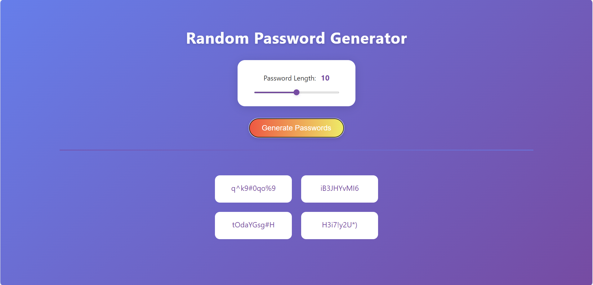

# Scrimba - Random Password Generator

A modern, responsive web app to generate secure random passwords.  
Easily choose password length, generate multiple suggestions, and copy any password with a single click.

## Features

- **Password Length Slider:** Select password length (8–12 characters).
- **Generate Passwords:** Instantly generate 4 strong, random passwords.
- **Copy to Clipboard:** Click any password to copy it (with visual feedback).
- **Responsive Design:** Clean, modern UI that works on all devices.
- **User Feedback:** Tooltips and messages guide you through copying.

## Usage

1. **Set Password Length:**  
   Use the slider to choose your desired password length.

2. **Generate Passwords:**  
   Click the "Generate Passwords" button to create four new suggestions.

3. **Copy a Password:**  
   Hover over a password to see "Click to copy".  
   Click a password to copy it to your clipboard.  
   A "Copied!" message will appear for confirmation.

## Technologies

- **HTML5**
- **CSS3** (with modern layout and gradients)
- **JavaScript** (ES6+, uses the Clipboard API)

## Customization

- You can adjust the character set in `script.js` to include/exclude symbols or numbers.
- Change the number of password fields by editing the HTML and CSS grid.

## Screenshots

## Credits

Inspired by [xdelmo/random-password-generator](https://github.com/xdelmo/random-password-generator).

https://scrimba.com/learn-javascript-c0v

---

**Enjoy your secure passwords!**